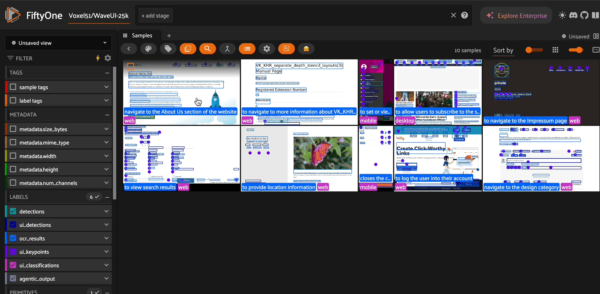

# 🤝 MiMo-VL + FiftyOne Integration

A FiftyOne Zoo integration for Xiaomi's MiMo-VL Vision-Language Models, providing state-of-the-art multimodal capabilities for computer vision tasks.



## Overview

This repository implements MiMo-VL models as remote zoo models for [FiftyOne](https://voxel51.com/docs/fiftyone/), enabling easy access to powerful vision-language capabilities. MiMo-VL-7B achieves exceptional performance across visual understanding, reasoning, and GUI interaction tasks, outperforming many larger models on standard benchmarks.

## Available Models

- **MiMo-VL-7B-RL**: Advanced model trained with Mixed On-policy Reinforcement Learning (MORL), outperforming Qwen2.5-VL-7B on 35 out of 40 evaluated tasks
- **MiMo-VL-7B-SFT**: Base model with strong reasoning capabilities after extensive 4-stage pre-training
- **MiMo-VL-7B-SFT-GGUF**: Quantized version for more efficient deployment

## Model Architecture

MiMo-VL-7B comprises three key components:
1. A native-resolution Vision Transformer (ViT) encoder that preserves fine-grained visual details
2. An MLP projector for efficient cross-modal alignment
3. The MiMo-7B language model specifically optimized for complex reasoning tasks

The model was trained through:
- Four-stage pre-training (2.4 trillion tokens) including projector warmup, vision-language alignment, general multimodal pre-training, and long-context SFT
- Mixed On-policy Reinforcement Learning (MORL) integrating diverse reward signals spanning perception accuracy, visual grounding, reasoning, and human preferences

## Key Capabilities

This integration supports multiple vision-language operations:

- **Visual Question Answering**: Answer complex questions about image content
- **Object Detection**: Precisely locate objects with bounding boxes
- **OCR**: Detect and extract text with spatial awareness
- **Keypoint Detection**: Identify points of interest in images
- **Classification**: Categorize image content with detailed labels
- **Agentic Interaction**: Generate actions for navigating graphical user interfaces

## Getting Started

### Installation

```bash
# Register the remote zoo model source
import fiftyone.zoo as foz
foz.register_zoo_model_source("https://github.com/harpreetsahota204/MiMo_VL")

# Load the model
model = foz.load_zoo_model("XiaomiMiMo/MiMo-VL-7B-RL")
```

### Available Checkpoints

The integration supports multiple checkpoints with different capabilities:

```python
# Load the RL-optimized model (best overall performance)
model = foz.load_zoo_model("XiaomiMiMo/MiMo-VL-7B-RL")

# Load the SFT model (strong baseline with lower resource requirements)
model = foz.load_zoo_model("XiaomiMiMo/MiMo-VL-7B-SFT")

# Load the GGUF quantized model (optimized for deployment efficiency)
model = foz.load_zoo_model("XiaomiMiMo/MiMo-VL-7B-SFT-GGUF")
```

### Usage Examples

```python
import fiftyone as fo
import fiftyone.zoo as foz

# Load a dataset
dataset = fo.Dataset.from_dir(...)

# Load the MiMo-VL model
model = foz.load_zoo_model(
      "XiaomiMiMo/MiMo-VL-7B-RL",
      # install_requirements=True, #you can pass this to make sure you have all reqs installed
      )

# Visual Question Answering
model.operation = "vqa"
model.prompt = "Describe what's happening in this image"
dataset.apply_model(model, label_field="vqa_results")

# Object Detection
model.operation = "detect"
model.prompt = "Locate all interactive elements in this UI"
dataset.apply_model(model, label_field="ui_detections")

# OCR
model.operation = "ocr"
model.prompt = "Extract all text from this document"
dataset.apply_model(model, label_field="text_detections")

# Keypoint Detection
model.operation = "point"
model.prompt = "Point to all clickable elements"
dataset.apply_model(model, label_field="ui_keypoints")

# Classification
model.operation = "classify"
model.prompt = "What type of interface is this?"
dataset.apply_model(model, label_field="ui_classifications")

# Using existing fields from the dataset as prompts
# If your dataset already has fields with prompts or instructions
model.operation = "vqa"
dataset.apply_model(model, prompt_field="questions", label_field="answers")

# Agentic UI Interaction using prompts from dataset field
model.operation = "agentic"
dataset.apply_model(model, prompt_field="purpose", label_field="ui_actions")
```

### Using Dataset Fields as Prompts

When your dataset already contains fields with questions, instructions, or task descriptions, you can use these directly:

```python
# Assume your dataset has a field called "user_query" with questions about images
model.operation = "vqa"
dataset.apply_model(model, prompt_field="user_query", label_field="model_response")

# Process a collection of detection tasks stored in the "detection_tasks" field
model.operation = "detect"
dataset.apply_model(model, prompt_field="detection_tasks", label_field="detected_objects")

# Run OCR using instructions from an "ocr_instructions" field
model.operation = "ocr"
dataset.apply_model(model, prompt_field="ocr_instructions", label_field="extracted_text")
```

This approach is particularly useful when:
- Processing batch queries with different prompts for each image
- Running evaluations with standardized prompts stored in the dataset
- Implementing multi-step workflows where each stage has specific instructions

## System Prompts

The integration provides optimized system prompts for each operation type:

- **Detection**: Specialized in detecting and localizing visual elements with bounding boxes
- **Keypoint Detection**: Identifies the center points of meaningful visual elements
- **Classification**: Provides comprehensive classification across visual domains
- **OCR**: Detects, reads and localizes text from any visual content
- **VQA**: Answers questions about images with clear, concise responses
- **Agentic**: Interacts with GUIs by analyzing interfaces and generating appropriate actions

## Requirements

- Transformers
- Huggingface Hub
- qwen-vl-utils
- accelerate

## License

This integration is licensed under the Apache 2.0 License. The MiMo-VL models are licensed under the MIT License.

## Citation

```bibtex
@misc{coreteam2025mimovltechnicalreport,
      title={MiMo-VL Technical Report}, 
      author={LLM-Core-Team Xiaomi},
      year={2025},
      eprint={2506.03569},
      archivePrefix={arXiv},
      primaryClass={cs.CL},
      url={https://arxiv.org/abs/2506.03569}, 
}
```
